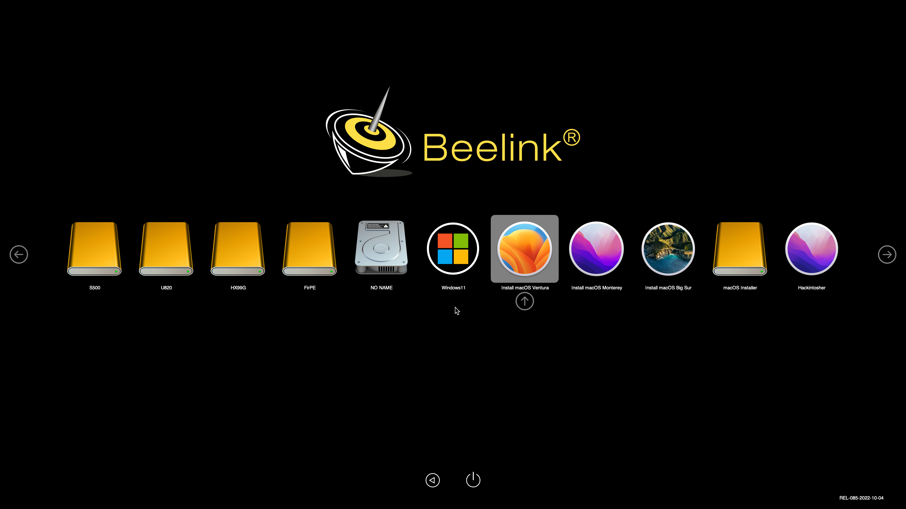
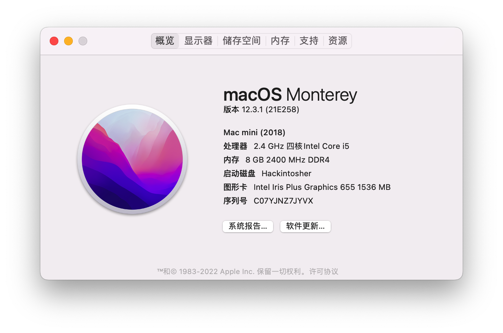
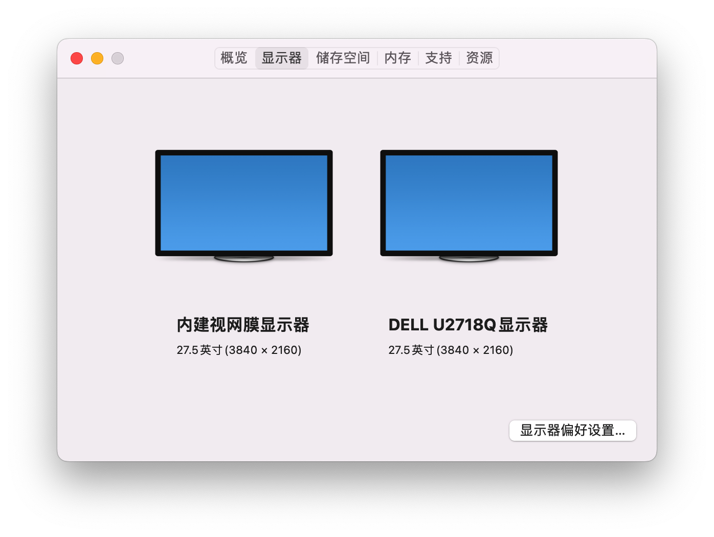
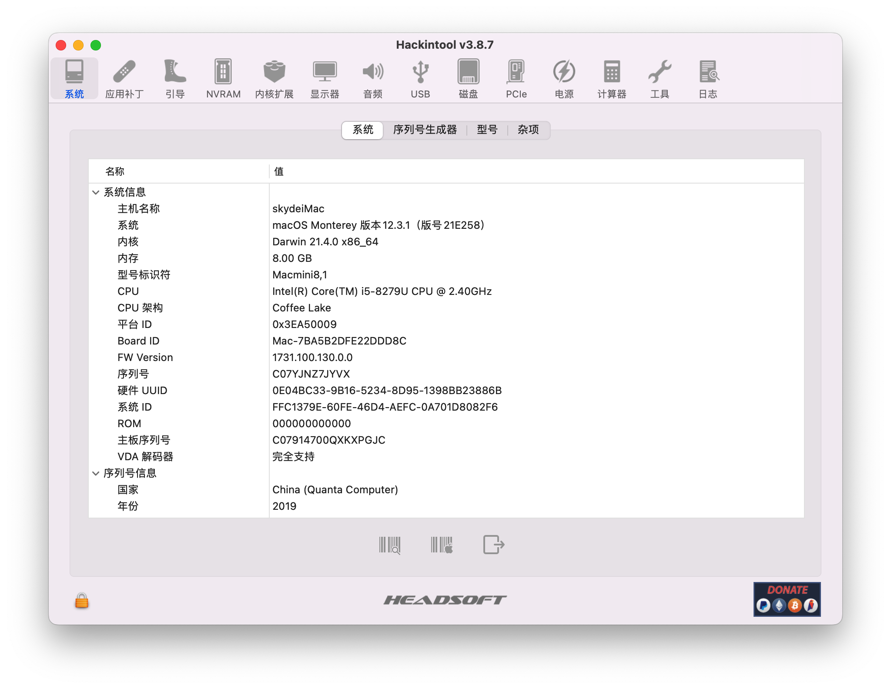
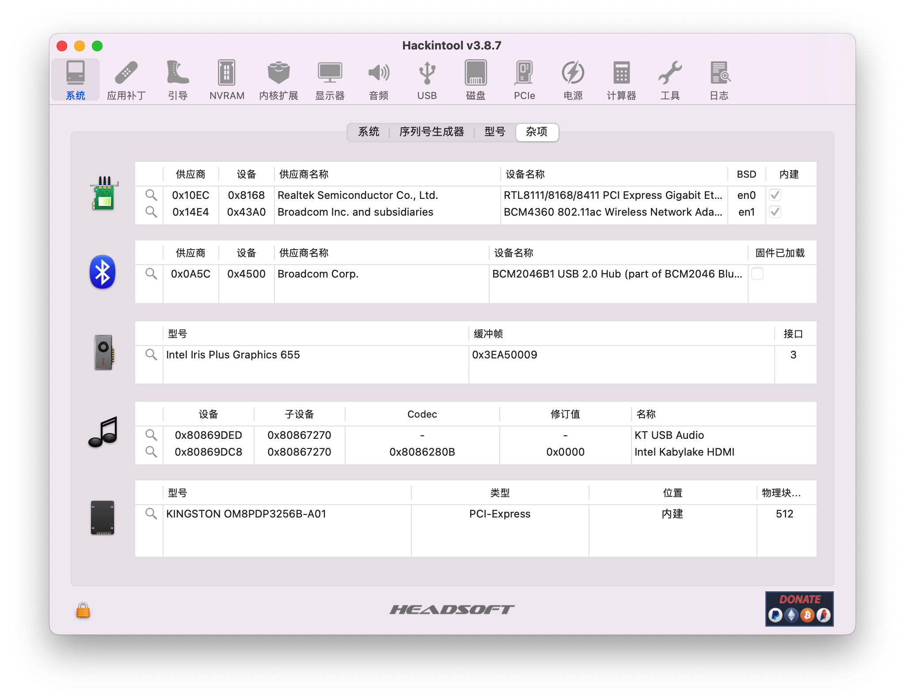
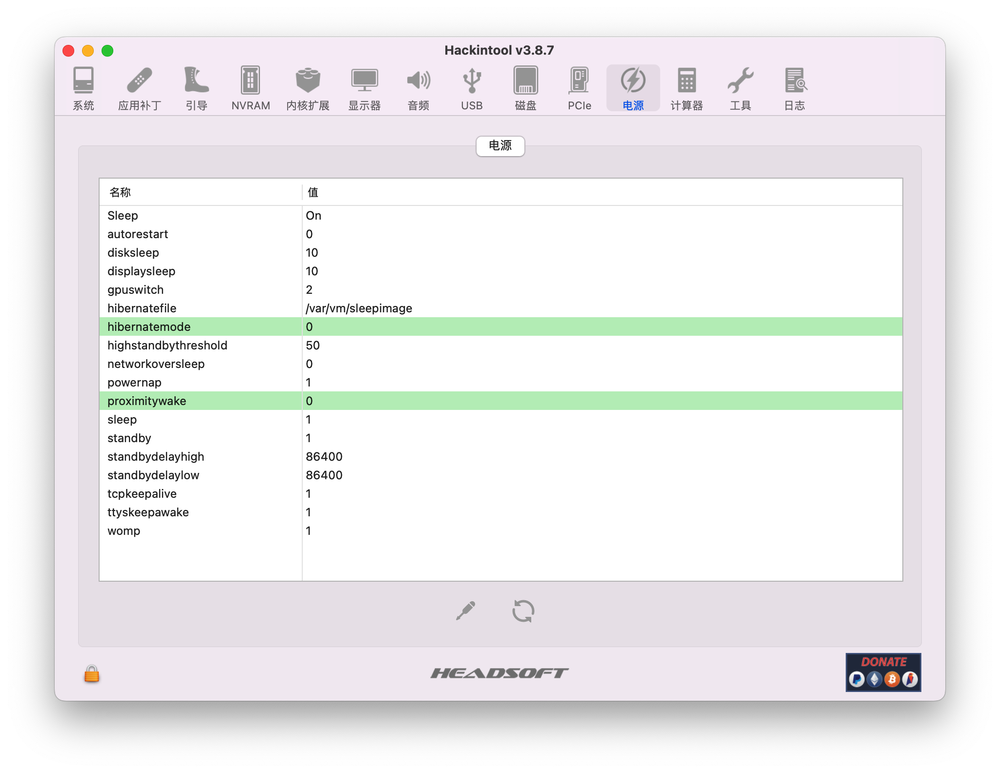
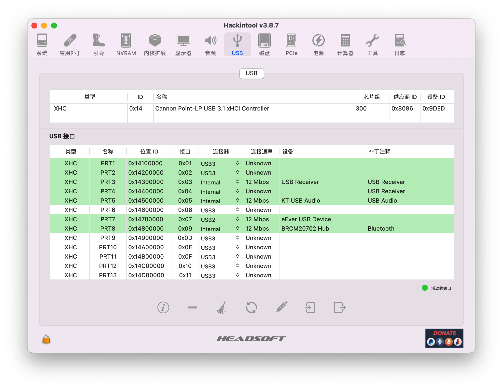
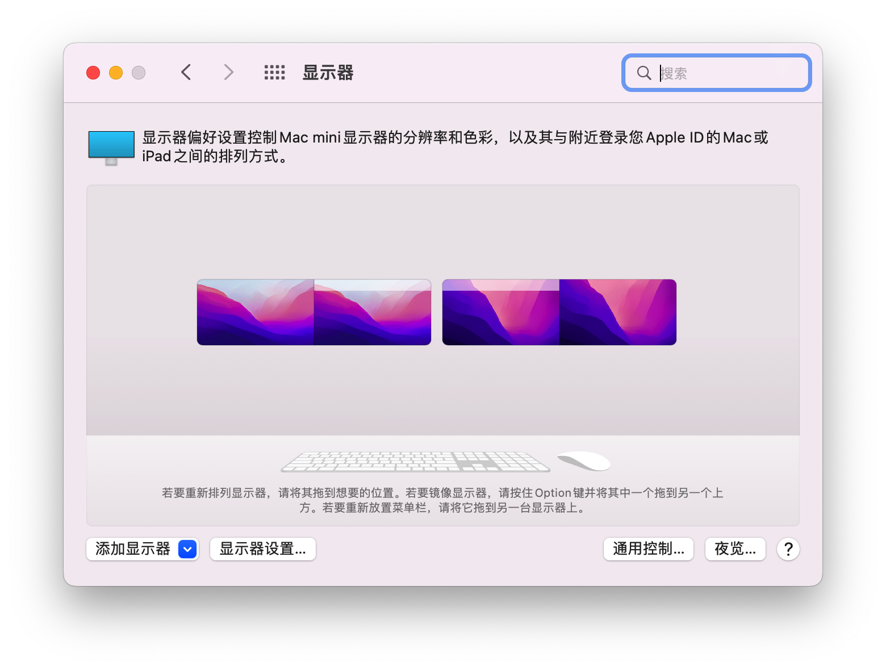
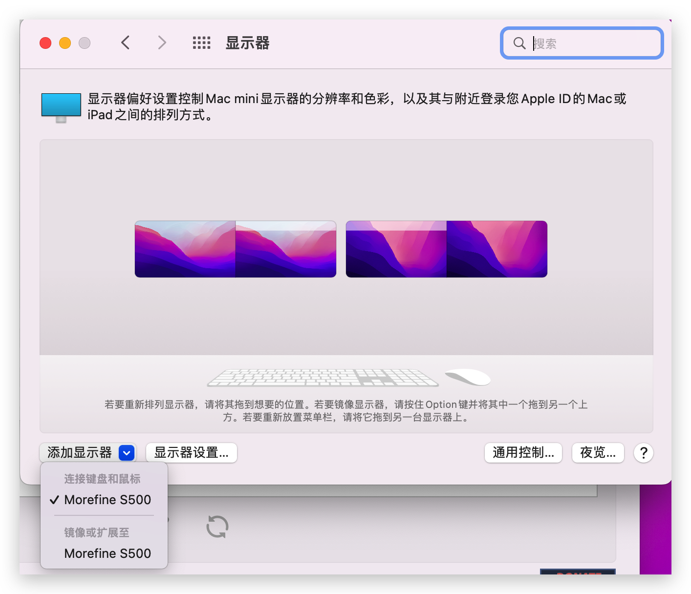
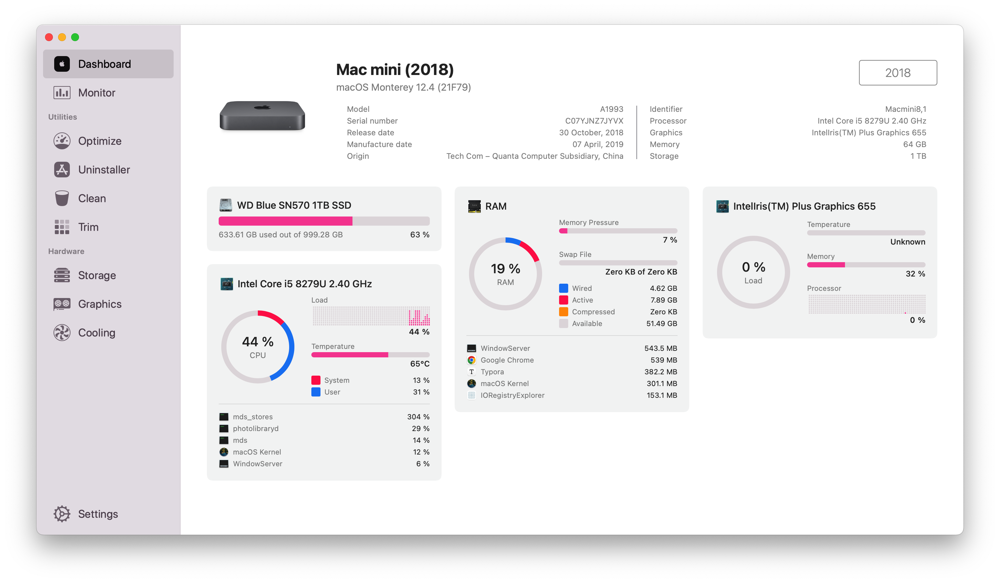

# Beelink-SEI8-Hackintosh

 
    

## 电脑配置

|   规格    |                           详细信息                           |
| :-------: | :----------------------------------------------------------: |
| 电脑型号  |                         Beelink SEI8                         |
| 操作系统  | macOS `Mojave` / `Catalina` / `Big Sur` / `Monterey` / `Ventura` / `Sonoma` / `Sequoia` |
|  处理器   |                     英特尔 酷睿 i5-8279U                     |
|   内存    |           64 GB 2400MHz(支持2400Mhz-3200Mhz DDR4)            |
|   硬盘1   |                   KINGSTON OM8PDP3256B-A01                   |
|  硬盘2/3  |                    可接SATA 2.5寸硬盘/SSD                    |
|   显卡    |                 Intel Iris Plus Graphics 655                 |
|  显示器   |                              无                              |
|   声卡    |                         KT USB Audio                         |
| 无线网卡  | m.2 NGFF插槽，默认出厂为 `Intel AX200` 已更换为[BCM94360Z3](https://blog.daliansky.net/uploads/WeChatandShop.png) |
| 有线网卡1 |     Realtek RTL8168H/8111H PCI Express Gigabit Ethernet      |

## 更新日志

- 8-13-2024
  - 更新`OpenCore` 到 `v1.0.1`
  - 支持 `Sequoia`
  
- 3-15-2024
  - 更新`OpenCore Mod` 到 `v0.9.9`
  - 更新 `IOSkywalkFamily.kext` 到 `v1.1.0`
  - `Sonoma` 如果想更新到 `14.4` 请务必先更新 `EFI` ，然后再安装 [OCLP](https://pan.daliansky.net/APPS/OCLP/OCLP.md)，重启后，再升级到 `14.4` 否则会出现 `WIFI` 无法启用的问题
- 3-13-2023
  - 更新 `OpenCore` 到 `v0.9.0`

  - Release `v1.1.0`
- 1-30-2023
  - 更新 `OpenCore` 到 `v0.8.9` 开发版
  - Release `v1.0.0`
- 10-10-2022
  - 更新 `OpenCore` 到 `v0.8.5`
- 9-22-2022
  - 更新 `OpenCore` 到 `v0.8.4`
  - 修复了 `HDMI` 音频输出问题
- 8-12-2022
  - 更新 `OpenCore` 到 `v0.8.3`
  - 新增 `OpenCore` 主题
    - 更新部分图标
- 5-31-2022
  - 修复了睡眠唤醒问题
  - 开通[wiki](https://github.com/daliansky/Beelink-SEi8-Hackintosh/wiki)

## 截图

